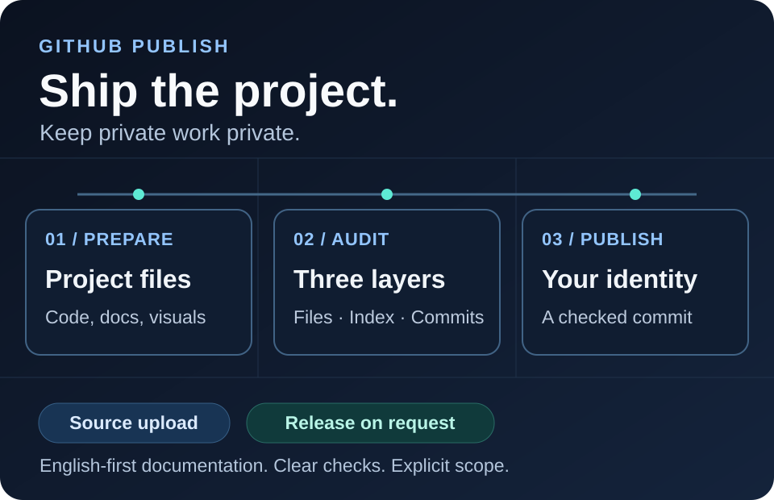

# GitHub Publish Skill

### 用于整理项目并发布到 GitHub 的 Codex Skill

**把本地项目整理成经过检查的 GitHub 成品，配齐中英文说明、项目图片，并保留你自己的贡献者身份。发布前分别检查候选文件、Git 暂存区和待推送提交。**

[English](README.md) | 中文

[功能亮点](#功能亮点) · [快速开始](#快速开始) · [使用示例](#使用示例) · [发布前审计](#发布前审计) · [详细文档](#详细文档)



*这是工作流程说明图，不是应用运行截图。发布操作由代理执行；随附的审计脚本只读。*

## 功能亮点

- **整理真正需要发布的内容。** 沿用项目现有结构，归拢源码、文档与资源，排除私人配置和开发对话。
- **检查三个范围。** 覆盖候选文件、完整 Git 暂存区，以及待推送范围中的最终文件树和中间提交。仅从最新版本删除文件，不能绕过历史检查。
- **保留贡献归属。** 核验当前 GitHub 账户与提交归属，优先使用已确认关联的 GitHub noreply 邮箱，并保留原有第三方署名。
- **提供中英文项目展示。** 准备英文 README、对应中文 README、双语仓库简介和适合项目的图片。
- **区分源码与版本发布。** 首次发布使用独立目录整理干净成品；更新时保留历史。只有明确要求发布版本时，才进入 Release 流程并单独审计附件。

## 快速开始

### 1. 准备工具

使用支持 Skill 的 Codex，并准备任务所需工具：

| 工具 | 用途 |
| --- | --- |
| [Git](https://git-scm.com/downloads) | 仓库操作，以及暂存区和提交审计 |
| [Python 3.9+](https://www.python.org/downloads/) | 使用标准库运行审计脚本 |
| [GitHub CLI（`gh`）](https://cli.github.com/) | 账户核验与 GitHub 发布 |
| [Gitleaks 8.19+](https://github.com/gitleaks/gitleaks/releases) | 所有审计范围中的秘密扫描 |

从官方渠道获取工具。用 `gh auth login` 登录，再用 `gh auth status` 检查登录状态，不要把令牌粘贴到对话中。

### 2. 安装 Skill

对 Codex 说：

```text
使用 $skill-installer 安装 https://github.com/cloudwallker/github-publish-skill
仓库根目录中的 Skill，安装名称为 github-publish。
```

Codex 会自动发现已安装的 Skill；如果未出现，请重启 Codex。安装 Skill 本身不等于授权发布任何项目。参见[官方 Skill 指南](https://developers.openai.com/codex/skills/)。

### 3. 给出明确任务

在 Codex 中打开项目，然后说：

```text
使用 $github-publish 整理并发布当前项目到我的 GitHub 账户，
创建名为 demo-project 的私有仓库。
```

代理会准备发布内容、核验身份、执行必要检查，并在授权范围内完成发布。身份关联证据不足或审计问题未解决时，需要先补齐再上传。

## 使用示例

| 任务 | 示例请求 |
| --- | --- |
| 只准备，不上传 | `使用 $github-publish 整理当前项目，准备发布到 GitHub，暂时不要上传。` |
| 公开发布 | `使用 $github-publish 将当前项目发布为名为 demo-project 的公开仓库。` |
| 更新已有仓库 | `使用 $github-publish 将当前项目改动推送到它已有的 GitHub 仓库。` |
| 发布版本 | `使用 $github-publish 发布 v1.0.0，附上已审查的发布附件和中英文版本说明。` |

默认偏好是**中文沟通**、**英文优先的项目文档**和**新仓库私有**。可以在 [SKILL.md](SKILL.md) 中定制语言与可见性偏好，也可以在任务请求中明确指定。已有仓库沿用原可见性，只有明确授权才会改变。

普通发布请求涵盖源码和必要资源，不自动附加 Release、PR 或 Pages 部署。本 Skill 不依赖 Superpowers，也不安装全局 hook。

## 发布前审计

`scripts/preflight.py` 读取项目并扫描临时快照，不暂存、提交、推送、删除项目文件或修改配置。它可以脱离 Codex 独立运行。

在本仓库根目录运行：

```sh
python scripts/preflight.py --help
python scripts/preflight.py files --root ../demo-project --gitleaks gitleaks
```

`../demo-project` 是合成示例路径，请替换为实际发布目录。使用 `PATH` 上可信的 Gitleaks，或指定其绝对路径。审计报告和人工复核记录应保存在项目之外。

| 范围 | 检查内容 |
| --- | --- |
| `files` | 发布目录，或 JSON 清单中精确指定的相对文件路径 |
| `staged` | Git 索引中所有文件的实际版本，包括未变化的已跟踪文件 |
| `commits` | 明确待推送范围内的最终文件树、中间文件树及提交消息 |

提交审计的 `--base` 使用已获取的远程 SHA，`--head` 使用固定的本地 SHA。只有新远程分支使用 `--base EMPTY`。Git 相关范围要求仓库根目录和完整历史。完整示例见[审计命令与复核记录](references/preflight.md)。

脚本输出 JSON，包含问题列表、文件清单、内容哈希、解析后的引用和整体指纹，不输出文件正文或命中的秘密内容。

| 状态 | 退出码 | 含义 |
| --- | --- | --- |
| `pass` | `0` | 当前快照的自动检查通过 |
| `blocked` | `1` | 存在必须先处理的阻止项 |
| `review_required` | `1` | 允许复核的项目需要实际检查，并记录绑定内容哈希的复核结果 |
| `incomplete` | `2` | 工具、输入、覆盖范围或能力限制导致检查未完成 |

**机器检查通过不保证绝对无泄露。** 代理仍需核对隐私语境、贡献者身份、图片与展示效果。秘密、明确的过程文件和检查失败不能通过人工记录豁免。内容变化后应重新检查受影响范围；使用 `--expect-fingerprint` 可对照相同范围及输入的旧审计结果检测变化。

## 详细文档

| 指南 | 内容 |
| --- | --- |
| [发布与身份](references/publishing.md) | 认证、提交归属、首次发布、更新与远程核验 |
| [文件与隐私](references/content-policy.md) | 保留、排除及待复核文件的判断规则 |
| [源码组织](references/source-layout.md) | 避免不必要重构的轻量整理 |
| [项目展示](references/presentation.md) | 双语 README、图片与排版核验 |
| [发布前检查](references/preflight.md) | CLI 参数、复核记录、扫描限制与附件替代审计 |
| [Release](references/releases.md) | 版本标签、附件独立检查、版本说明和校验文件 |

`SKILL.md` 是工作流入口，`agents/openai.yaml` 提供 Skill 元数据。`scripts/` 存放只读审计工具，`references/` 存放操作指南，`tests/` 使用临时合成仓库进行回归测试。

审计限制包括：每文件 20 MiB、每次审计 256 MiB、每个归档最多 1,000 项、归档嵌套深度 3、最多 1,000 个待推送提交。支持递归检查 ZIP、TAR 和 GZIP。图片需要查看画面并检查元数据；不支持的格式、Git 外部对象及其他覆盖缺口需要单独处理。审计大型项目或发布包前，请阅读检查指南。

## 贡献与归属

由 [@cloudwallker](https://github.com/cloudwallker) 维护。贡献时请保持中英文文档一致，使用合成测试数据，并保留合法贡献者及来源署名。工作流参考来源见对应指南。

测试套件需要 Git、Gitleaks，以及用于图像测试样本的 [Pillow](https://pillow.readthedocs.io/en/stable/installation.html)。准备好依赖后运行 `python -m unittest discover -s tests -v`；指定可信扫描器的方法见[本地测试说明](references/preflight.md#本地测试)。测试用例覆盖暂存区快照、历史问题、归档、脱敏、指纹变化和人工复核边界。
